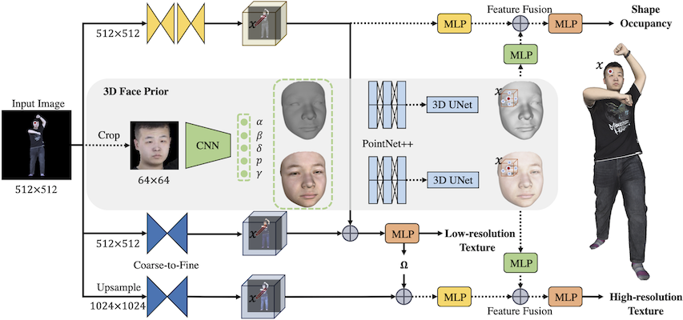
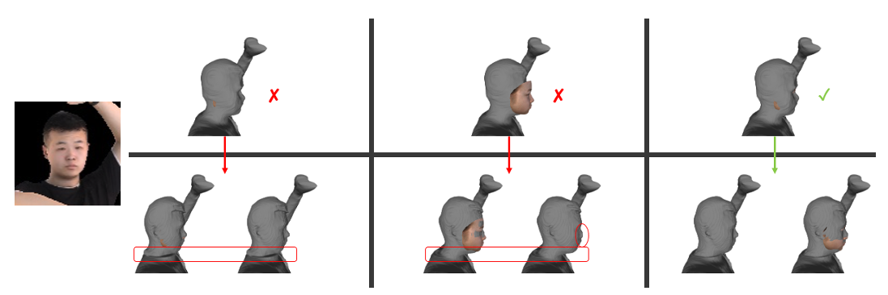

# JIFF: Jointly-aligned Implicit Face Function for High Quality Single View Clothed Human Reconstruction
This repository includes PyTorch implementation of **[ JIFF: Jointly-aligned Implicit Face Function for High Quality Single View Clothed Human Reconstruction](https://arxiv.org/abs/2204.10549)**, tested with PyTorch 1.10.0 on Ubuntu 18.04, CUDA 10.2.
<br>
[Yukang Cao](https://yukangcao.github.io/CV_Yukang_Cao.pdf), [Guanying Chen](https://guanyingc.github.io/), [Kai Han](http://www.kaihan.org/), [Wenqi Yang](https://github.com/ywq), [Kwan-Yee K. Wong](http://i.cs.hku.hk/~kykwong/)
<br>
<p align="center">
    
</p>

Work-done:
- Environment configuration
 - [x] For rendering `THUman2.0` data with `pyrender` and `pyexr`
 - [x] For generating 3DMM mesh for `THUman2.0` rendered images
 - [x] For Pipeline training and testing
- Data Preprocessing
 - [x] `THUman2.0` data rendering
 - [x] 3DMM mesh preprocessing
 - [x] DECA mesh preprocessing
 - [x] ICP stuff to align the meshes
- Training
 - [x] Training the geometry pipeline
 - [x] Coarse training of texture pipeline (PIFu-Tex)
 - [x] Fine training of texture pipeline with 3DMM priors
 - [x] Training scripts
- Testing and pretrained models
 - [x] Reconstructed meshes
 - [x] Test PIFu estimated geometry and texture trained with same sampling strategy
 - [x] Test jiff estimated geometry and texture
## JIFF reconstruction examples
Our method further improve the face geometry and texture. It also successfully reconstructs the ears.
<p align="center">
    
<!--  -->
</p>

## 1. Environment configuration

The environment (in conda `yaml`) for `JIFF` training and testing.
```
conda env create -f environment_JIFF.yaml
conda activate JIFF
```
You may also need to install `torch_scatter` manually for the 3D encoder
```
pip install torch==1.10.0+cu102 torchvision==0.11.0+cu102 torchaudio==0.10.0 -f https://download.pytorch.org/whl/torch_stable.html
pip install torch-scatter==2.0.9 -f https://pytorch-geometric.com/whl/torch-1.10.0+cu102.html
```
If you are using RTX 3090 or higher, please install `torch`, `torchvision`, and `torch-scatter` correspondingly, i.e.,
```
pip install torch==1.10.0+cu111 torchvision==0.11.1+cu111 torchaudio==0.10.0 -f https://download.pytorch.org/whl/torch_stable.html
pip install torch-scatter==2.0.9 -f https://pytorch-geometric.com/whl/torch-1.10.0+cu111.html
```
Follow [pytorch3d](https://github.com/facebookresearch/pytorch3d/blob/main/INSTALL.md) and [kaolin](https://kaolin.readthedocs.io/en/latest/notes/installation.html) to install the required package.

## 2. Dataset preprocessing

We use `THUman2.0` dataset for training and testing. You can download it from [this link](https://github.com/ytrock/THuman2.0-Dataset) after 
following the instruction and sending the request form.

1. Before moving to the rendering part, we find it better to rescale the meshes to be in the similar scale as in `RenderPeople` and translate the meshes to be at the center of its mass. You could add -o to specify the output path, otherwise the input meshes will be overwritten. Note that although not a must, it's better to rotate the mesh to the frontal view.
```
python -m apps.rescale_THU -i {path_to_THUman2.0_dataset}
```

2. Generating the [precomputed radiance transfer (PRT)](https://sites.fas.harvard.edu/~cs278/papers/prt.pdf) for each obj mesh as in instructed in `PIFu`:
```
python -m apps.prt_util -i {path_to_THUman2.0_dataset}
```

3. Rendering the meshes into 360-degree images. Together with `RENDER` folder for images, it will generate the `MASK`, `PARAM`, `UV_RENDER`, `UV_MASK`, `UV_NORMAL`, `UV_POS`, and copy the meshes to `GEO/OBJ`. Remember to add -e to enable EGL rendering.
```
python -m apps.render_data -i {path_to_THUman2.0_dataset} -o {path_to_THUman2.0_processed_for_training} -e
```

4. Please follow [Deep3DFaceReconstruction](https://github.com/microsoft/Deep3DFaceReconstruction.git) and [PyTorch version](https://github.com/yuhaoooo/Deep3DFaceReconstruction-Pytorch.git) first. The instructions will lead you to "01_MorphableModel.mat", "BFM_model_front.mat", "Exp_Pca.bin", and "params.pt". Put the first four into the ./Face_Preprocess/BFM subfolder, and the last one to ./Face_Preprocess/tdmm_utils/models subfolder.

Thanks for [AnimeHead](https://github.com/jiuxianghedonglu/AnimeHeadDetection), you could download their weights for head detection from [here](https://pan.baidu.com/s/1Mw9aulKGuFJesIsbcFfxhQ#list/path=%2F) and put it into ./Face_Preprocess/detect_utils

After downloading and putting the models in designated place, the Folder would be like:
```
Face_Preprocess/
├── BFM
│   ├── BFM_model_front.mat
│   ├── Exp_Pca.bin
│   ├── 01_MorphableModel.mat
├── detect_utils
│   ├── best_model.pt
├── tdmm_utils
│   ├── models
│   │   ├── params.pt
│	....
```
5. Detecting the face region in images and generate the 3DMM mesh based on [Deep3DFaceReconstruction](https://github.com/microsoft/Deep3DFaceReconstruction.git). This processing would generate `FACE_3DMM`, `FACE_REGION`, `FILE_NUMBER`
```
python ./Face_Preprocess/Process_face_seperately.py -i {path_to_THUman2.0_processed_for_training}/RENDER -o {path_to_THUman2.0_processed_for_training}
```
Due to the unrobustness of face / head estimation under extremely large pose situation, we suggest to rotate the front-view face / head mesh to certain angle for better training.

7. Applying [Iterative Closet Point (ICP)](https://en.wikipedia.org/wiki/Iterative_closest_point) to better align ground-truth mesh and 3DMM mesh
```
python ./Face_Preprocess/icp_align_gt.py -i {path_to_THUman2.0_processed_for_training}
```
The results will overwrite the previously estimated 3DMM meshes.

After the whole processing, the Dataset Directory would be like:
```
THU2_processed/
├── FILE_NUMBER
├── FACE_REGION
├── FACE_3DMM
├── UV_RENDER
├── UV_POS
├── UV_NORMAL
├── UV_MASK
├── PARAM
├── MASK
├── GEO/OBJ
├── val.txt
```
## Training
1. Training the geometry pipeline (The training would take around 40 hours per epoch)
```
python -m apps.train_jiff_shape --dataroot {path_to_THUman2.0_processed_for_training} --random_flip --random_scale --num_stack 4 --num_hourglass 2 --resolution 512 --hg_down 'ave_pool' --norm 'group' --val_train_error --val_test_error --gpu_ids=0,1,2 --batch_size 3 --learning_rate 0.0001 --norm_color 'group' --sigma 3.5 --checkpoints_path {your_checkpoints_folder} --results_path {your_results_folder} --num_threads 10 --schedule 4
```
2. Training the texture pipline

Coarse Pipeline
```
python -m apps.train_color_coarse --dataroot {path_to_THUman2.0_processed_for_training} --random_flip --random_scale --num_stack 4 --num_hourglass 2 --resolution 512 --hg_down 'ave_pool' --norm 'group' --val_train_error --val_test_error --gpu_ids=0,1,2 --batch_size 3 --learning_rate 0.0001 --norm_color 'group' --sigma 0.1 --checkpoints_path '{your_checkpoints_folder} --results_path {your_results_folder} --num_threads 10 --load_netG_checkpoint_path {path_to_your_netG_checkpoint} --num_sample_inout 0 --num_sample_color 10000
```
Fine Pipeline (The training would take around 30 hours per epoch)
```
python -m apps.train_jiff_color_fine --dataroot {path_to_THUman2.0_processed_for_training} --random_flip --random_scale --num_stack 4 --num_hourglass 2 --resolution 512 --hg_down 'ave_pool' --norm 'group' --val_train_error --val_test_error --gpu_ids=0,1,2 --batch_size 3 --learning_rate 0.0001 --norm_color 'group' --sigma 0.1 --checkpoints_path '{your_checkpoints_folder} --results_path {your_results_folder} --num_threads 10 --load_netG_checkpoint_path {path_to_your_netG_checkpoint} --load_netC_coarse_checkpoint_path {path_to_your_netC_coarse_checkpoint} --num_sample_inout 0 --num_sample_color 10000
```

## Testing
We provide [reconstructed results](https://connecthkuhk-my.sharepoint.com/:u:/g/personal/yukang_connect_hku_hk/Ed5ovN_qbAZLjbt4e_4cejQBtzBrvCHwLFq3EYij2W3SLw?e=dRcgBu) on THuman2.0 testdataset and renderpeople freemodel for your reference. 

For testing, you would need to provide the mask image together with the rendered image.
1. you would need to reconstruct a rough model based on PIFu. The reconstruction is then used to help icp align 3dmm to get better face prior.

```
python ./apps/eval_pifu.py --batch_size 1 --num_stack 4 --num_hourglass 2 --resolution 512 --hg_down 'ave_pool' --norm 'group' --norm_color 'group' --test_folder_path {path_to_your_testdata} --load_netG_checkpoint_path {path_to_your_netG_checkpoint} --name 'coarse_recontruction' --load_netC_coarse_checkpoint_path {path_to_your_netC_coarse_checkpoint}
```
Note that this will give you the PIFu reconstruction with its own texture. The sampling stragety stays the same as JIFF. Under this circumstance, you could simply compare PIFu (with more face sampling) with JIFF.

2. Detect the face region, and estimated 3DMM mesh from the input image

```
python ./Face_Preprocess/gen_3dmm.py -i {test_image_folder}
```

3. ICP alignment between the rough reconstruction and 3DMM mesh

```
python ./Face_Preprocess/align_3dmm.py -pifu {path_to_pifu_reconstruction} -test {path_to_test_folder}
```

REMINDER FOR THE ALIGNMENT BETWEEN ROUGH RECONSTRUCTION ADN 3DMM:
<p align="center">
    
</p>
Check the 3dmm mesh and PIFu coarse reconstruction after the icp alignment to see if the rough shape is well aligned, as the face reconstruction will depend on 3dmm mesh. The possible shift along the x, y, z axis will affect the quality of both geometry and texture. 

4. Reconstruct JIFF model by given the detected face region, estimated 3DMM mesh, input and mask image

```
python3 ./apps/eval_jiff.py --batch_size 1 --num_stack 4 --num_hourglass 2 --resolution 512 --hg_down 'ave_pool' --norm 'group' --norm_color 'group' --test_folder_path {path_to_your_testdata} --load_netG_checkpoint_path {path_to_your_netG_checkpoint} --name 'test_jiff' --load_netC_coarse_checkpoint_path {path_to_your_netC_coarse_checkpoint} --load_netC_checkpoint_path {path_to_your_netC_checkpoint}
```

## Citation
If you find this code useful, please consider citing
```bibtex
@inproceedings{cao22jiff,
    author    = {Cao, Yukang and Chen, Guanying and Han, Kai and Yang, Wenqi and Wong, Kwan-Yee K.},
    title     = {JIFF: Jointly-Aligned Implicit Face Function for High Quality Single View Clothed Human Reconstruction},
    booktitle = {Proceedings of the IEEE/CVF Conference on Computer Vision and Pattern Recognition (CVPR)},
    month     = {June},
    year      = {2022},
    pages     = {2729-2739}
}
```
## Acknowledgements
Our implementation is based on [PIFu](https://github.com/shunsukesaito/PIFu.git) and [Deep3DFaceReconstruction](https://github.com/microsoft/Deep3DFaceReconstruction.git) (and [its pytorch version](https://github.com/yuhaoooo/Deep3DFaceReconstruction-Pytorch.git)). 

This work was partially supported by Hong Kong RGC GRF grant (project# 17203119), the National Key R&D Program of China (No.2018YFB1800800), and the Basic Research Project No. HZQB-KCZYZ2021067 of Hetao Shenzhen-HK S&T Cooperation Zone. We thank Yuanlu Xu for sharing results of ARCH and ARCH++.

